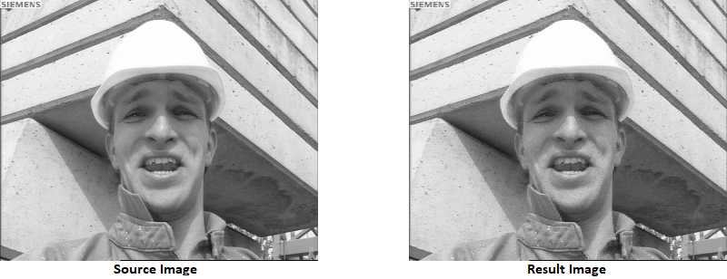
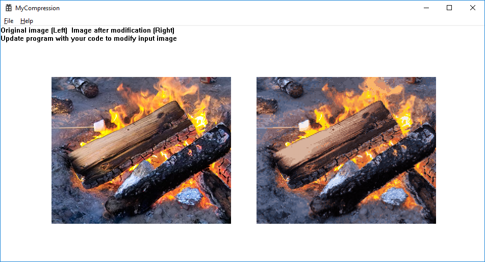

# Vector Quantization for Image Compression

This is an implementation of [vector quantization](https://en.wikipedia.org/wiki/Vector_quantization) for image compression on Win32API(C++). This generates a compressed image corrresponding to a input image. I added vector quantization module to this which is based on basic starter code which draw image on the screen.


### Vector Quantization

Vector Quantization chooses best N vectors to express an image. Assume the size of vector is two. In this case, two pixel values of an image represent a vector. If the image is gray scale, each pixel has a range from 0 to 255. Thus, a vector contains a pair of a byte value. Let's say, an arbitrary two vectors contains (135, 240) and (135, 241). The latter can be replaced by the former since two vectors are enough similar. So, the code book contains former vector and assigns index to it. The image uses indices to express whole image. Finally, the image is compressed based on the code book. Therefore, Vector Quantization chooses best N vector to express an image. The less the N is, the higher compression rate the image achieves. I used [K-Means Clustering](https://en.wikipedia.org/wiki/K-means_clustering) to choose best N vectors.


### Sample results



The repository includes:
* Source code
* Sample Image files
* Sample screen shots

### Datasets

* .RAW files are in the one channel or grayscale format. Each image is 352x288 demensions.
* .RGB files are in the three channel or 24 bits, which 352x288 red bytes, followed by 352x288 green, and 352x288 blue.


## Building Environment
* Microsoft Window 10
* Microsoft Visual Studio Community 2015 Version 14.0.25431.01 Update 3

### Project Setting

```bash
All Configurations
Project - Property page - Configuration Properties - C/C++ - Preprocessor Definitions - add _CRT_SECURE_NO_WARNINGS
Project - Property page - Configuration Properties - General - Character Set - No Set
Project - Property page - Configuration Properties - Commend Arguments - image1.rgb 64 1 (Optional. This option means the source Image name is image1.rgb and number of vectors is 64 and vector size is 2)
```

### Compile 
```bash
Set running configuration to Release
Build - Build Solution
```

### Run
```bash
> %(Solution Dir)\Release\MyCompression.exe imagename numOfVector vecSize(1-(1x2), 2-(2x2), 3-(4x4))
ex) > %(Solution Dir)\Release\MyCompression.exe image2.rgb 64 2
```

### Demo



### Status

This is a second assignment of CSCI-576 Multimedia System Design, 2018 fall

Version 1.0

